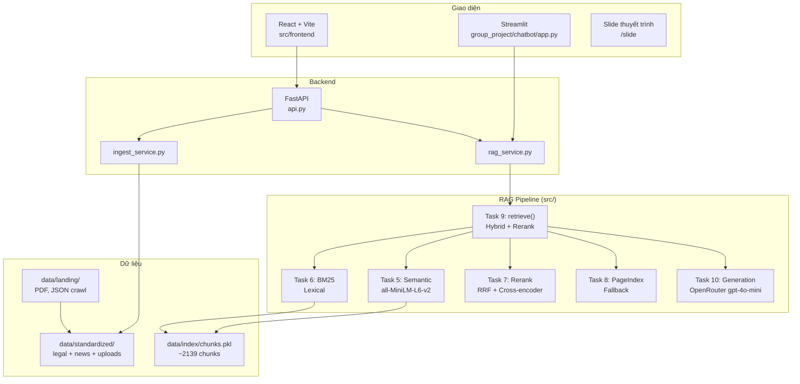

# Ngày 8 — RAG Pipeline v2

**Chương 2 | Ngày 8 trong 15**

---

## Mục Tiêu

Xây dựng một RAG pipeline thực tế, end-to-end, từ thu thập dữ liệu pháp luật và báo chí về ma tuý → xử lý → indexing → retrieval (hybrid + vectorless fallback) → generation có citation.

---

## Chủ Đề Dữ Liệu

**Pháp luật Việt Nam về ma tuý và các chất cấm** + **Các bài báo về nghệ sĩ liên quan tới ma tuý**

---

## Cấu Trúc Thư Mục

```
day_08_rag_pipeline_v2/
├── README.md
├── data/
│   ├── landing/          ← Task 1 & 2: raw files (PDF, DOCX, HTML)
│   └── standardized/     ← Task 3: converted markdown files
├── src/
│   ├── __init__.py
│   ├── task1_collect_legal_docs.py
│   ├── task2_crawl_news.py
│   ├── task3_convert_markdown.py
│   ├── task4_chunking_indexing.py
│   ├── task5_semantic_search.py
│   ├── task6_lexical_search.py
│   ├── task7_reranking.py
│   ├── task8_pageindex_vectorless.py
│   ├── task9_retrieval_pipeline.py
│   └── task10_generation.py
├── notebooks/
│   └── demo.ipynb         ← Notebook demo cho buổi trình bày
├── group_project/
│   └── README.md          ← Hướng dẫn bài tập nhóm
├── requirements.txt
└── .env.example
```

---

## Nhiệm Vụ Chi Tiết

### Task 1 — Thu Thập Văn Bản Pháp Luật (Cá nhân)

Tìm và tải về **tối thiểu 3 văn bản pháp luật** dạng PDF/DOCX về ma tuý và các chất cấm. Lưu vào `data/landing/`.

**Gợi ý nguồn:**

- Luật Phòng, chống ma tuý 2021 (Luật số 73/2021/QH15)
- Nghị định 105/2021/NĐ-CP hướng dẫn thi hành Luật Phòng chống ma tuý
- Bộ luật Hình sự 2015 (sửa đổi 2017) — Chương XX: Các tội phạm về ma tuý
- Thông tư liên tịch về danh mục chất ma tuý và tiền chất

**Yêu cầu:**

- Lưu file gốc (PDF/DOCX) vào `data/landing/legal/`
- Đặt tên file rõ ràng: `luat-phong-chong-ma-tuy-2021.pdf`, `nghi-dinh-105-2021.pdf`, ...

---

### Task 2 — Crawl Bài Báo (Cá nhân)

Crawl **tối thiểu 5 bài báo** về các nghệ sĩ Việt Nam liên quan tới ma tuý.

**Thư viện khuyến nghị:** [Crawl4AI](https://github.com/unclecode/crawl4ai)

**Yêu cầu:**

- Lưu output vào `data/landing/news/`
- Mỗi bài báo lưu thành 1 file (JSON hoặc HTML)
- Ghi rõ metadata: URL gốc, ngày crawl, tiêu đề bài báo

**Code mẫu (Crawl4AI):**

```python
from crawl4ai import AsyncWebCrawler

async def crawl_article(url: str, output_dir: str):
    async with AsyncWebCrawler() as crawler:
        result = await crawler.arun(url=url)
        # Lưu result.markdown vào file
        ...
```

---

### Task 3 — Convert Sang Markdown (Cá nhân)

Sử dụng [MarkItDown](https://github.com/microsoft/markitdown) của Microsoft để convert toàn bộ file trong `data/landing/` thành Markdown.

**Cài đặt:**

```bash
pip install markitdown
```

**Code mẫu:**

```python
from markitdown import MarkItDown

md = MarkItDown()

# Convert PDF
result = md.convert("data/landing/legal/luat-phong-chong-ma-tuy-2021.pdf")
print(result.text_content)

# Convert DOCX
result = md.convert("data/landing/legal/nghi-dinh-105-2021.docx")
```

**Yêu cầu:**

- Output lưu vào `data/standardized/`
- Giữ nguyên cấu trúc thư mục con (`legal/`, `news/`)
- Mỗi file output có tên tương ứng: `luat-phong-chong-ma-tuy-2021.md`

---

### Task 4 — Chunking & Indexing (Cá nhân)

Chọn **một loại chunking strategy** và **một embedding model** để index toàn bộ markdown files vào vector store.

**Chunking — khuyến khích dùng [langchain-text-splitters](https://python.langchain.com/docs/modules/data_connection/document_transformers/):**

```bash
pip install langchain-text-splitters
```

Các loại splitter phù hợp:

- `RecursiveCharacterTextSplitter` (mặc định, an toàn)
- `MarkdownHeaderTextSplitter` (tốt cho file có heading rõ)
- `SemanticChunker` (nâng cao, dùng embedding để tách)

**Embedding model gợi ý:**

- `sentence-transformers/all-MiniLM-L6-v2` (nhẹ, nhanh)
- `BAAI/bge-m3` (multilingual, tốt cho tiếng Việt)
- OpenAI `text-embedding-3-small` (nếu có API key)

**Vector Store — khuyến cáo dùng Weaviate:**

```bash
pip install weaviate-client
```

- Weaviate hỗ trợ hybrid search (dense + BM25) built-in
- Có thể dùng Docker hoặc Weaviate Cloud
- Alternatives: ChromaDB (đơn giản), FAISS (nếu chỉ cần dense)

**Yêu cầu:**

- Ghi rõ trong code: dùng chunking nào, chunk_size bao nhiêu, overlap bao nhiêu, vì sao
- Ghi rõ embedding model nào, dimension bao nhiêu
- Index thành công toàn bộ documents

---

### Task 5 — Semantic Search Module (Cá nhân)

Viết module thực hiện **semantic search** (dense retrieval) trên vector store.

**Yêu cầu:**

```python
def semantic_search(query: str, top_k: int = 10) -> list[dict]:
    """
    Returns:
        List of {'content': str, 'score': float, 'metadata': dict}
    """
    ...
```

- Input: query string + top_k
- Output: danh sách chunks có score, sorted descending
- Phải hoạt động được với embedding model đã chọn ở Task 4

---

### Task 6 — Lexical Search Module (Cá nhân)

Viết module thực hiện **lexical search**. Mặc định sử dụng **BM25**.

```bash
pip install rank-bm25
```

**Code mẫu BM25:**

```python
from rank_bm25 import BM25Okapi

# Tokenize corpus
tokenized_corpus = [doc.split() for doc in corpus]
bm25 = BM25Okapi(tokenized_corpus)

# Search
tokenized_query = query.split()
scores = bm25.get_scores(tokenized_query)
```

**Yêu cầu:**

```python
def lexical_search(query: str, top_k: int = 10) -> list[dict]:
    """
    Returns:
        List of {'content': str, 'score': float, 'metadata': dict}
    """
    ...
```

**Bonus:** Nếu dùng phương pháp khác (TF-IDF, Elasticsearch, Weaviate BM25 built-in), hãy giải thích cơ chế hoạt động trong buổi demo → **+5 điểm bonus**.

---

### Task 7 — Reranking Module (Cá nhân)

Viết module **reranking** để chấm lại độ liên quan của kết quả retrieval.

**Lựa chọn (chọn 1):**


| Phương pháp                      | Thư viện / Model                            | Đặc điểm                         |
| -------------------------------- | ------------------------------------------- | -------------------------------- |
| Cross-encoder reranker           | `jinaai/jina-reranker-v2-base-multilingual` | Multilingual, tốt cho tiếng Việt |
| Cross-encoder reranker           | `Qwen/Qwen3-Reranker-0.6B`                  | Nhẹ, hiệu quả                    |
| MMR (Maximal Marginal Relevance) | Tự implement                                | Giảm trùng lặp, tăng diversity   |
| RRF (Reciprocal Rank Fusion)     | Tự implement                                | Gộp kết quả từ nhiều ranker      |


**Code mẫu (Jina Reranker via API):**

```python
import requests

def rerank(query: str, documents: list[str], top_k: int = 5) -> list[dict]:
    response = requests.post(
        "https://api.jina.ai/v1/rerank",
        headers={"Authorization": "Bearer YOUR_API_KEY"},
        json={
            "model": "jina-reranker-v2-base-multilingual",
            "query": query,
            "documents": documents,
            "top_n": top_k
        }
    )
    return response.json()["results"]
```

**Yêu cầu:**

```python
def rerank(query: str, candidates: list[dict], top_k: int = 5) -> list[dict]:
    """
    Re-score and re-order candidates based on relevance to query.
    """
    ...
```

---

### Task 8 — PageIndex Vectorless RAG (Cá nhân)

Đăng ký tài khoản tại [https://pageindex.ai/](https://pageindex.ai/), sau đó sử dụng [PageIndex SDK](https://github.com/VectifyAI/PageIndex) để tạo một **vectorless RAG pipeline**.

**Cài đặt:**

```bash
pip install pageindex
```

**Tham khảo:** [https://github.com/VectifyAI/PageIndex](https://github.com/VectifyAI/PageIndex)

**Yêu cầu:**

- Upload tài liệu lên PageIndex
- Viết function query PageIndex và trả về kết quả

```python
def pageindex_search(query: str, top_k: int = 5) -> list[dict]:
    """
    Vectorless retrieval using PageIndex.
    Fallback khi hybrid search không trả về kết quả phù hợp.
    """
    ...
```

---

### Task 9 — Retrieval Pipeline Hoàn Chỉnh (Cá nhân)

Kết hợp tất cả modules thành một **retrieval pipeline** thống nhất với logic fallback:

```
Query
  │
  ├─→ Semantic Search (Task 5)  ──┐
  │                                ├─→ Merge + Rerank (Task 7) → Results
  ├─→ Lexical Search (Task 6)  ──┘
  │
  └─→ Nếu hybrid search không có kết quả đủ tốt (score < threshold)
        └─→ Fallback: PageIndex Vectorless (Task 8)
```

**Yêu cầu:**

```python
def retrieve(query: str, top_k: int = 5, score_threshold: float = 0.3) -> list[dict]:
    """
    1. Chạy semantic_search + lexical_search
    2. Merge kết quả (RRF hoặc weighted fusion)
    3. Rerank
    4. Nếu top result score < threshold → fallback PageIndex
    5. Return top_k results
    """
    ...
```

---

### Task 10 — Generation Có Citation (Cá nhân)

Sắp xếp lại context chunks sau reranking để **tránh lost in the middle**, inject vào prompt, và yêu cầu LLM trả lời có **citation**.

**Document Reordering (tránh lost in the middle):**

```python
def reorder_for_llm(chunks: list[dict]) -> list[dict]:
    """
    Sắp xếp chunks theo pattern: quan trọng nhất ở đầu và cuối,
    ít quan trọng hơn ở giữa.
    Ví dụ: [1, 3, 5, 4, 2] thay vì [1, 2, 3, 4, 5]
    """
    ...
```

**Prompt template:**

```python
SYSTEM_PROMPT = """Answer the following question comprehensively.
For every statement of fact or claim, immediately insert a citation
in brackets linking to the specific source
(e.g., [Author/Platform Name, Year]).
If the information is not explicitly stated in the provided context
or knowledge base, state 'I cannot verify this information'
rather than guessing."""

def generate_with_citation(query: str, context_chunks: list[dict]) -> str:
    """
    1. Reorder chunks để tránh lost in the middle
    2. Format context với source metadata
    3. Inject vào prompt với SYSTEM_PROMPT
    4. Gọi LLM (OpenAI, Gemini, hoặc local model)
    5. Return answer có citation
    """
    ...
```

**Yêu cầu:**

- Chọn top_k và top_p phù hợp (giải thích lý do trong code comment)
- Output phải có citation dạng `[Nguồn, Năm]`
- Nếu không đủ evidence → trả về "I cannot verify this information"

---

## Bài Tập Nhóm

> **Sau khi hoàn thành bài cá nhân**, ngồi lại với nhóm để xây dựng **1 trong 2 sản phẩm** sau:

---

### Yêu cầu 1: Sản phẩm nhóm RAG Chatbot

Xây dựng chatbot trả lời câu hỏi về pháp luật ma tuý và tin tức liên quan.

**Yêu cầu:**

- Giao diện chat (Streamlit / Gradio / Chainlit)
- Trả lời có citation (dựa trên Task 10)
- Hỗ trợ follow-up questions (conversation memory)
- Hiển thị source documents đã dùng

**Stack gợi ý:**

```
Chainlit/Streamlit → Retrieval (Task 9) → Generation (Task 10) → Display
```

---

### Yêu cầu 2: RAG Evaluation Pipeline

Sử dụng **1 trong 3 framework** sau để evaluate pipeline RAG của nhóm:

#### Framework lựa chọn


| Framework                                            | Cài đặt                | Đặc điểm                                       |
| ---------------------------------------------------- | ---------------------- | ---------------------------------------------- |
| [DeepEval](https://github.com/confident-ai/deepeval) | `pip install deepeval` | Nhiều metric built-in, dễ integrate với pytest |
| [RAGAS](https://github.com/explodinggradients/ragas) | `pip install ragas`    | Chuẩn industry cho RAG eval, 3 trục chính      |
| [TruLens](https://github.com/truera/trulens)         | `pip install trulens`  | Dashboard UI, feedback functions mạnh          |


#### Yêu cầu Evaluation

1. **Tạo Golden Dataset** — tối thiểu 15 cặp Q&A (question, expected_answer, expected_context)
2. **Chạy evaluation** trên toàn bộ golden dataset với các metrics sau:
  - **Faithfulness** — câu trả lời có bám đúng context không?
  - **Answer Relevance** — câu trả lời có đúng câu hỏi không?
  - **Context Recall** — retriever có lấy đủ evidence không?
  - **Context Precision** — trong context lấy về, bao nhiêu % thực sự hữu ích?
3. **So sánh A/B** — chạy eval trên ít nhất 2 config khác nhau (ví dụ: có reranking vs không reranking, hoặc hybrid vs dense-only)
4. **Báo cáo** — bảng điểm + phân tích worst performers + đề xuất cải tiến

#### Code mẫu — DeepEval

```python
from deepeval import evaluate
from deepeval.metrics import (
    FaithfulnessMetric,
    AnswerRelevancyMetric,
    ContextualRecallMetric,
    ContextualPrecisionMetric,
)
from deepeval.test_case import LLMTestCase

# Tạo test cases từ golden dataset
test_cases = []
for item in golden_dataset:
    result = rag_pipeline.generate_with_citation(item["question"])
    test_case = LLMTestCase(
        input=item["question"],
        actual_output=result["answer"],
        expected_output=item["expected_answer"],
        retrieval_context=[c["content"] for c in result["sources"]],
    )
    test_cases.append(test_case)

# Chạy evaluation
metrics = [
    FaithfulnessMetric(threshold=0.7),
    AnswerRelevancyMetric(threshold=0.7),
    ContextualRecallMetric(threshold=0.7),
    ContextualPrecisionMetric(threshold=0.7),
]

results = evaluate(test_cases, metrics)
```

#### Code mẫu — RAGAS

```python
from ragas import evaluate
from ragas.metrics import (
    faithfulness,
    answer_relevancy,
    context_recall,
    context_precision,
)
from datasets import Dataset

# Chuẩn bị data
eval_data = {
    "question": [],
    "answer": [],
    "contexts": [],
    "ground_truth": [],
}

for item in golden_dataset:
    result = rag_pipeline.generate_with_citation(item["question"])
    eval_data["question"].append(item["question"])
    eval_data["answer"].append(result["answer"])
    eval_data["contexts"].append([c["content"] for c in result["sources"]])
    eval_data["ground_truth"].append(item["expected_answer"])

dataset = Dataset.from_dict(eval_data)

# Chạy evaluation
result = evaluate(
    dataset,
    metrics=[faithfulness, answer_relevancy, context_recall, context_precision],
)
print(result.to_pandas())
```

#### Code mẫu — TruLens

```python
from trulens.apps.custom import TruCustomApp, instrument
from trulens.core import Feedback
from trulens.providers.openai import OpenAI as TruOpenAI

provider = TruOpenAI()

# Define feedback functions
f_faithfulness = Feedback(provider.groundedness_measure_with_cot_reasons).on_output()
f_relevance = Feedback(provider.relevance).on_input_output()
f_context_relevance = Feedback(provider.context_relevance).on_input()

# Wrap RAG pipeline
tru_rag = TruCustomApp(
    rag_pipeline,
    app_name="DrugLaw_RAG",
    feedbacks=[f_faithfulness, f_relevance, f_context_relevance],
)

# Run evaluation
with tru_rag as recording:
    for item in golden_dataset:
        rag_pipeline.generate_with_citation(item["question"])

# View dashboard
from trulens.dashboard import run_dashboard
run_dashboard()
```

#### Deliverable Evaluation

- File `group_project/evaluation/golden_dataset.json` — 15+ cặp Q&A
- File `group_project/evaluation/eval_pipeline.py` — script chạy evaluation
- File `group_project/evaluation/results.md` — bảng điểm + phân tích
- So sánh A/B ít nhất 2 configs

---

### Yêu Cầu Chung

1. **Tích hợp pipeline** từ bài cá nhân của các thành viên
2. **Demo hoạt động được** trong buổi trình bày (chạy local hoặc deploy)
3. **Hoàn thành 1 trong 2 sản phẩm nhóm** — RAG Chatbot *hoặc* Evaluation pipeline *(nhóm Arionear: Yêu cầu 1)*
4. **Code push lên repository** chung của nhóm
5. **README** mô tả kiến trúc và phân công (xem `group_project/README.md`)

---

### Kiến Trúc Hệ Thống

Dự án nhóm **Arionear** — RAG chatbot tư vấn pháp luật ma túy Việt Nam, tích hợp pipeline cá nhân (Task 1–10) thành sản phẩm end-to-end.

**Lựa chọn nhóm:** Yêu cầu 1 — Sản phẩm nhóm RAG Chatbot *(không thực hiện Yêu cầu 2: RAG Evaluation Pipeline)*

**Nhóm thực hiện:**


| Thành viên          | MSSV        |
| ------------------- | ----------- |
| Nguyễn Trọng Nguyên | 2A202600548 |
| Nguyễn Thành Tài    | 2A202600627 |
| Ngô Thị Ánh         | 2A202600979 |
| Nguyễn Hồ Diệu Linh | 2A202600567 |





**Luồng xử lý một câu hỏi:**

```
User query
    │
    ▼
rag_service.chat_with_citation()
    ├─ Mở rộng query (pháp luật / tin tức / alias tên nghệ sĩ)
    ├─ retrieve() — semantic + BM25 → RRF merge → cross-encoder rerank
    ├─ Full source coverage — đại diện từ MỌI file trong data/standardized/
    ├─ enrich metadata (URL, links từ markdown header)
    ├─ reorder_for_llm() — tránh lost in the middle
    └─ LLM + guardrails (Karpathy) → answer + citations + sources
```


| Thành phần   | Công nghệ                              | Ghi chú                              |
| ------------ | -------------------------------------- | ------------------------------------ |
| Chunking     | `RecursiveCharacterTextSplitter`       | size=500, overlap=50                 |
| Embedding    | `all-MiniLM-L6-v2`                     | 384 dim, local index                 |
| Vector store | `chunks.pkl` + Weaviate (optional)     | Fallback local khi không có Weaviate |
| Retrieval    | Hybrid dense + BM25 + RRF rerank       | PageIndex fallback khi score thấp    |
| LLM          | OpenRouter `gpt-4o-mini`               | temp=0.3, top_p=0.9                  |
| Frontend     | React 19 + TanStack Router + shadcn/ui | Brand `#fd6217`                      |
| Backend      | FastAPI + uvicorn                      | CORS cho localhost:5173              |


**Knowledge base hiện tại:**


| Loại            | Số file   | Ví dụ                                                    |
| --------------- | --------- | -------------------------------------------------------- |
| Legal           | 3         | Bộ luật Hình sự Ch.XX, Luật PCMT 2021, Thông tư danh mục |
| News            | 6         | Miu Lê Cát Bà, Long Nhật/SONM TPHCM, Bình Gold…          |
| Upload          | 1+        | File user upload qua UI                                  |
| **Tổng chunks** | **~2139** | `data/index/chunks.pkl`                                  |


---

### Sản Phẩm: Arionear Chatbot


| Tính năng            | Mô tả                                              | File chính                                |
| -------------------- | -------------------------------------------------- | ----------------------------------------- |
| Chat có citation     | Trích dẫn `[Nguồn, Năm]` + URL bài báo             | `rag_service.py`, `llm_guardrails.py`     |
| Conversation memory  | 6 turn gần nhất, hỗ trợ follow-up                  | `rag_service.py`                          |
| Full source coverage | Mỗi câu hỏi đọc đại diện tất cả nguồn standardized | `rag_service.py`                          |
| Source panel         | Xem excerpt, URL, link gốc từng chunk              | `ChatFeed.tsx`, `SourceDialog.tsx`        |
| Knowledge panel      | Danh sách tài liệu + upload PDF/DOCX/MD            | `KnowledgePanel.tsx`, `ingest_service.py` |
| Lịch sử chat         | Lưu session localStorage                           | `chat-history.ts`, `Sidebar.tsx`          |
| Voice-to-text        | Web Speech API `vi-VN`                             | `useSpeechRecognition.ts`                 |
| AI Prompt Box        | Input nâng cao (voice, attach, modes)              | `ai-prompt-box.tsx`, `Composer.tsx`       |
| Slide thuyết trình   | 7 slide animated tại `/slide`                      | `PresentationSlides.tsx`                  |


---

### Cấu Trúc `group_project/`

```
group_project/
├── chatbot/
│   ├── rag_service.py      # Core RAG: retrieval + generation + memory
│   ├── api.py              # FastAPI — /api/chat, /api/upload, /api/knowledge-base
│   ├── app.py              # Streamlit UI (demo nhanh)
│   └── ingest_service.py   # Upload → markdown → re-index
├── evaluation/             # Skeleton Yêu cầu 2 — nhóm không triển khai
└── README.md
```

---

### Phân Công Công Việc

**Bài nhóm — Yêu cầu 1 (RAG Chatbot):**


| Thành viên          | MSSV        | Nhiệm vụ                                                            | Trạng thái |
| ------------------- | ----------- | ------------------------------------------------------------------- | ---------- |
| Ngô Thị Ánh         | 2A202600979 | Frontend React (Arionear UI): chat, sidebar, slide `/slide`         | ✅          |
| Nguyễn Hồ Diệu Linh | 2A202600567 | FastAPI backend (`api.py`), ingest upload, tích hợp `rag_service`   | ✅          |
| Nguyễn Trọng Nguyên | 2A202600548 | Knowledge base: metadata URL, full source coverage, query expansion | ✅          |
| Nguyễn Thành Tài    | 2A202600627 | Streamlit demo (`app.py`), kiểm thử retrieval end-to-end            | ✅          |


---

### Hướng Dẫn Chạy

#### Bước 1 — Cài đặt

```bash
# Python dependencies
pip install -r requirements.txt

# Frontend dependencies
cd src/frontend && npm install && cd ../..
```

Tạo `.env` từ `.env.example`:

```bash
cp .env.example .env
```

Điền tối thiểu:

```env
OPENROUTER_API_KEY=sk-or-...
OPENAI_BASE_URL=https://openrouter.ai/api/v1
LLM_MODEL=openai/gpt-4o-mini
```

Tùy chọn (rerank + PageIndex fallback):

```env
JINA_API_KEY=jina_...
PAGEINDEX_API_KEY=pi_...
```

#### Bước 2 — Index dữ liệu (lần đầu hoặc sau khi thêm file)

```bash
# Convert landing → standardized (nếu chưa có)
python src/task3_convert_markdown.py

# Chunk + embed → data/index/chunks.pkl
python src/task4_chunking_indexing.py
```

#### Bước 3A — React UI + FastAPI (khuyến nghị demo)

Terminal 1 — Backend:

```bash
uvicorn group_project.chatbot.api:app --reload --port 8000
```

Terminal 2 — Frontend:

```bash
cd src/frontend
npm run dev
```

Mở [http://localhost:5173](http://localhost:5173) — chat tại `/`, slide thuyết trình tại `/slide`.

#### Bước 3B — Streamlit (demo nhanh, không cần npm)

```bash
streamlit run group_project/chatbot/app.py
```

#### Bước 4 — Chạy test bài cá nhân

```bash
pytest tests/ -v
```

---

### API Reference (FastAPI)


| Method | Endpoint              | Mô tả                                       |
| ------ | --------------------- | ------------------------------------------- |
| `GET`  | `/api/health`         | Health check                                |
| `GET`  | `/api/knowledge-base` | Thông tin KB (documents, chunk count)       |
| `POST` | `/api/chat`           | Chat RAG — body: `{ message, history[] }`   |
| `POST` | `/api/upload`         | Upload tài liệu (PDF/DOCX/MD/TXT, max 20MB) |


**Ví dụ chat:**

```bash
curl -X POST http://localhost:8000/api/chat \
  -H "Content-Type: application/json" \
  -d '{"message": "Hình phạt tội tàng trữ ma túy là gì?", "history": []}'
```

---

### Demo Queries

**Pháp luật:**

- "Hình phạt cho tội tàng trữ trái phép chất ma túy là gì?"
- "Luật Phòng chống ma túy 2021 quy định gì về cai nghiện?"
- "Khác nhau giữa tàng trữ và sử dụng trái phép về mức xử phạt?"

**Tin tức:**

- "Gần đây có vụ bắt ma túy lớn nào đáng chú ý tại Việt Nam?"
- "Có những nghệ sĩ nào đã sử dụng ma túy?"
- "Rapper Bình Vàng dính tội gì?" *(alias → Bình Gold)*

**Follow-up (memory):**

1. "Miu Lê bị khởi tố vì gì?"
2. "Hình phạt tội đó theo BLHS là bao nhiêu năm?"

**Chitchat:**

- "Bây giờ là mấy giờ?" — trả lời ngắn gọn, vẫn đọc toàn bộ nguồn standardized

---

### Yêu Cầu 2 — RAG Evaluation Pipeline

> **Nhóm không thực hiện** Yêu cầu 2. Chỉ tập trung hoàn thiện **Yêu cầu 1: Arionear RAG Chatbot** (giao diện, citation, memory, source panel, upload tài liệu).
>
> Thư mục `group_project/evaluation/` giữ skeleton tham khảo từ đề bài; không phải deliverable của nhóm.

---

### Lưu Ý

- **Restart backend** sau khi sửa `rag_service.py` hoặc `llm_guardrails.py` (uvicorn `--reload` tự pick up).
- Một số bài crawl (`article_02`, `article_04`) trả về 404 — retrieval đã lọc chunk rác crawl.
- Câu hỏi tin tức (vd. "vụ bắt gần đây") dùng query expansion + chọn chunk bài báo thông minh — tránh chunk sidebar crawl.
- Nghị định 105 PDF là scan — chất lượng OCR có thể kém; ưu tiên Luật PCMT 2021 DOCX.
- Upload file mới qua UI → tự convert + re-index toàn bộ `data/standardized/`.
- Giữ repo này nếu học **Track 3 Giai đoạn 2** — sẽ mở rộng lên **Knowledge Graph** cho câu hỏi phức tạp.

---

## Cài Đặt Môi Trường

Xem [Hướng Dẫn Chạy](#bước-1--cài-đặt) trong mục Bài Tập Nhóm. Tóm tắt:

```bash
pip install -r requirements.txt
cp .env.example .env   # điền OPENROUTER_API_KEY
cd src/frontend && npm install
```

**Yêu cầu hệ thống:** Python 3.10+, Node.js 18+, ~2GB RAM (embedding model local).

---

## Chấm Điểm

### Tổng Quan Phân Bổ Điểm


| Thành phần      | Tỷ trọng | Mô tả                                               |
| --------------- | -------- | --------------------------------------------------- |
| **Bài Cá Nhân** | **50%**  | 10 tasks, chấm bằng automated tests + manual review |
| **Bài Nhóm**    | **30%**  | RAG Chatbot hoặc Evaluation pipeline (chọn 1)       |
| **Bonus**       | **20%**  | Các tiêu chí nâng cao (xem bên dưới)                |


---

### Bài Cá Nhân — 50 điểm (50%)

Chấm bằng automated test suite (`pytest tests/ -v`). Mỗi task có test riêng.


| Task     | Nội dung                                                                  | Điểm   | Test            |
| -------- | ------------------------------------------------------------------------- | ------ | --------------- |
| 1        | Thu thập văn bản pháp luật (≥3 files tồn tại trong `data/landing/legal/`) | 3      | `test_task1_`*  |
| 2        | Crawl bài báo (≥5 files tồn tại trong `data/landing/news/`)               | 3      | `test_task2_*`  |
| 3        | Convert markdown (files tồn tại trong `data/standardized/`)               | 4      | `test_task3_*`  |
| 4        | Chunking + Indexing (vector store có data)                                | 7      | `test_task4_*`  |
| 5        | Semantic search trả về kết quả đúng format, sorted                        | 6      | `test_task5_*`  |
| 6        | Lexical search (BM25) trả về kết quả đúng format                          | 6      | `test_task6_*`  |
| 7        | Reranking hoạt động, output re-sorted                                     | 6      | `test_task7_*`  |
| 8        | PageIndex query trả về kết quả                                            | 4      | `test_task8_*`  |
| 9        | Retrieval pipeline + fallback logic hoạt động                             | 7      | `test_task9_*`  |
| 10       | Generation có citation + reorder                                          | 4      | `test_task10_*` |
| **Tổng** |                                                                           | **50** |                 |


---

### Bài Nhóm — 30 điểm (30%)

Nhóm chọn **một trong hai** yêu cầu. Nhóm Arionear thực hiện **Yêu cầu 1** (RAG Chatbot).


| Tiêu chí                                             | Điểm   | Nhóm Arionear       |
| ---------------------------------------------------- | ------ | ------------------- |
| RAG Chatbot demo hoạt động được                      | 8      | ✅                   |
| Tích hợp pipeline các thành viên                     | 4      | ✅                   |
| Kiến trúc rõ ràng + README                           | 3      | ✅                   |
| Chất lượng câu trả lời (có citation, đúng nội dung)  | 3      | ✅                   |
| **Evaluation pipeline** (DeepEval / RAGAS / TruLens) | **12** | — *không thực hiện* |
| — Golden dataset ≥15 Q&A pairs                       | 3      | —                   |
| — Chạy eval với ≥4 metrics                           | 4      | —                   |
| — So sánh A/B ≥2 configs + phân tích                 | 3      | —                   |
| — Báo cáo kết quả có phân tích worst performers      | 2      | —                   |


---

### Bonus — 20 điểm (20%)

Demo hoặc đặt câu hỏi mà nhóm đang demo khiến LLM không trả lời được (mỗi câu 5 điểm)

---

### Chạy Test Chấm Điểm Bài Cá Nhân

```bash
# Chạy toàn bộ test suite
pytest tests/ -v

# Chạy từng task
pytest tests/test_individual.py::TestTask1 -v
pytest tests/test_individual.py::TestTask5 -v
```

---

## Hướng Dẫn Thời Gian


| Giai đoạn | Thời gian | Hoạt động                          |
| --------- | --------- | ---------------------------------- |
| Task 1–3  | 0:00–0:45 | Thu thập data + convert markdown   |
| Task 4–6  | 0:45–1:45 | Chunking, indexing, search modules |
| Task 7–8  | 1:45–2:15 | Reranking + PageIndex setup        |
| Task 9–10 | 2:15–3:00 | Pipeline hoàn chỉnh + generation   |
| Bài nhóm  | Ngoài giờ | Tích hợp + build demo              |


---

## Tài Liệu Tham Khảo

- [Crawl4AI](https://github.com/unclecode/crawl4ai) — Web crawling library
- [MarkItDown](https://github.com/microsoft/markitdown) — Microsoft document converter
- [LangChain Text Splitters](https://python.langchain.com/docs/modules/data_connection/document_transformers/) — Chunking strategies
- [Weaviate](https://weaviate.io/developers/weaviate) — Vector database with hybrid search
- [rank-bm25](https://github.com/dorianbrown/rank_bm25) — BM25 implementation
- [PageIndex](https://github.com/VectifyAI/PageIndex) — Vectorless RAG
- [Jina Reranker](https://jina.ai/reranker/) — Cross-encoder reranking API
- Liu et al. (2023), *Lost in the Middle: How Language Models Use Long Contexts*
- [DeepEval](https://github.com/confident-ai/deepeval) — RAG evaluation framework
- [OpenRouter](https://openrouter.ai/) — LLM API gateway

